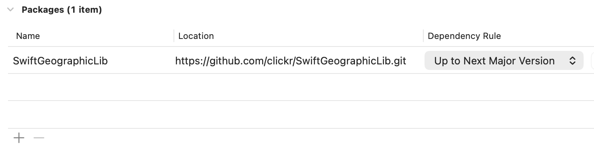
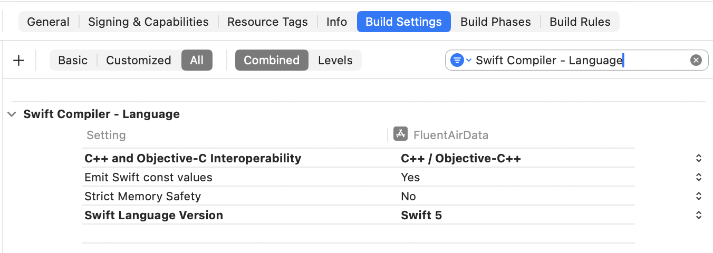

# `SwiftGeographicLib`

## ``GeographicLib``

GeographicLib is a fork of [](https://github.com/geographiclib/geographiclib) with
a couple of minor changes to enable it to be used in a swift package
### Constants.hpp
In order
#### Before
```C++
#include <GeographicLib/Config.h>
```
#### After

```C++
#if !defined(SWIFT_PACKAGE)
#include <GeographicLib/Config.h>
#endif
```
### GeographicLib.h
Bridging header for swift. SPM needs this. At this stage I have taken a "kitchen sink" approach
> Warning: Much of this code can throw errors that cannot be handled or anticpated by swift.
```C++
#if defined(SWIFT_PACKAGE)
#include "GeographicLib/Accumulator.hpp"
#include "GeographicLib/AuxAngle.hpp"
#include "GeographicLib/AlbersEqualArea.hpp"
#include "GeographicLib/AzimuthalEquidistant.hpp"
#include "GeographicLib/CassiniSoldner.hpp"
#include "GeographicLib/Constants.hpp"
#include "GeographicLib/DMS.hpp"
#include "GeographicLib/Ellipsoid.hpp"
#include "GeographicLib/GARS.hpp"
#include "GeographicLib/GeoCoords.hpp"
#include "GeographicLib/Geodesic.hpp"
#include "GeographicLib/GeodesicLine.hpp"
#include "GeographicLib/Geohash.hpp"
#include "GeographicLib/Geoid.hpp"
#include "GeographicLib/Georef.hpp"
#include "GeographicLib/Gnomonic.hpp"
#include "GeographicLib/GravityCircle.hpp"
#include "GeographicLib/GravityModel.hpp"
#include "GeographicLib/Intersect.hpp"
#include "GeographicLib/LambertConformalConic.hpp"
#include "GeographicLib/LocalCartesian.hpp"
#include "GeographicLib/MagneticCircle.hpp"
#include "GeographicLib/MagneticModel.hpp"
#include "GeographicLib/Math.hpp"
#include "GeographicLib/MGRS.hpp"
#include "GeographicLib/NearestNeighbor.hpp"
#include "GeographicLib/OSGB.hpp"
#include "GeographicLib/PolarStereographic.hpp"
#include "GeographicLib/PolygonArea.hpp"
#include "GeographicLib/Rhumb.hpp"
#include "GeographicLib/SphericalHarmonic2.hpp"
#include "GeographicLib/TransverseMercator.hpp"
#include "GeographicLib/Utility.hpp"
#endif
```
## ``Geodesic``

## ``UTMUPS``
Convert between geographic coordinates and UTM/UPS

UTM and UPS are defined
- J. W. Hager, J. F. Behensky, and B. W. Drew,
  <a href="https://web.archive.org/web/20161214054445/http://earth-info.nga.mil/GandG/publications/tm8358.2/TM8358_2.pdf">
  The Universal Grids: Universal Transverse Mercator (UTM) and Universal
  Polar Stereographic (UPS)</a>, Defense Mapping Agency, Technical Manual
  TM8358.2 (1989).
.
Section 2-3 defines UTM and section 3-2.4 defines UPS.  This document also
includes approximate algorithms for the computation of the underlying
transverse Mercator and polar stereographic projections.  Here we
substitute much more accurate algorithms given by
GeographicLib:TransverseMercator and GeographicLib:PolarStereographic.
These are the algorithms recommended by the NGA document
- <a href="https://earth-info.nga.mil/php/download.php?file=coord-utmups">
  The Universal Grids and the Transverse Mercator and Polar Stereographic
  Map Projections</a>, NGA.SIG.0012 (2014).

In this implementation, the conversions are closed, i.e., output from
Forward is legal input for Reverse and vice versa.  The error is about 5nm
in each direction.  However, the conversion from legal UTM/UPS coordinates
to geographic coordinates and back might throw an error if the initial
point is within 5nm of the edge of the allowed range for the UTM/UPS
coordinates.

The simplest way to guarantee the closed property is to define allowed
ranges for the eastings and northings for UTM and UPS coordinates.  The
UTM boundaries are the same for all zones.  (The only place the
exceptional nature of the zone boundaries is evident is when converting to
UTM/UPS coordinates requesting the standard zone.)  The MGRS lettering
scheme imposes natural limits on UTM/UPS coordinates which may be
converted into MGRS coordinates.  For the conversion to/from geographic
coordinates these ranges have been extended by 100km in order to provide a
generous overlap between UTM and UPS and between UTM zones.

The <a href="http://www.nga.mil">NGA</a> software package
<a href="https://earth-info.nga.mil/index.php?dir=wgs84&action=wgs84#tab_geotrans">geotrans</a>
also provides conversions to and from UTM and UPS.  Version 2.4.2 (and
earlier) suffers from some drawbacks:
- Inconsistent rules are used to determine the whether a particular UTM or
  UPS coordinate is legal.  A more systematic approach is taken here.
- The underlying projections are not very accurately implemented.

The GeographicLib::UTMUPS::EncodeZone encodes the UTM zone and hemisphere
to allow UTM/UPS coordinated to be displayed as, for example, "38N 444500
3688500".  According to NGA.SIG.0012_2.0.0_UTMUPS the use of "N" to denote
"north" in the context is not allowed (since a upper case letter in this
context denotes the MGRS latitude band).  Consequently, as of version
1.36, EncodeZone uses the lower case letters "n" and "s" to denote the
hemisphere.  In addition EncodeZone accepts an optional final argument \e
abbrev, which, if false, results in the hemisphere being spelled out as in
"38north".
### ``UTMUPSCoordinate``
```swift
import CoreLocation
public enum Hemisphere {
    case northern
    case southern
}
public protocol UTMUPSCoordinate {
    var hemisphere : Hemisphere { get }
    var easting : Double { get }
    var northing : Double { get }
    var convergence : Double { get }
    var scale : Double { get }
    var locationCoordinate2D : CLLocationCoordinate2D { get }
}
```
### XCode Project Package Dependency

### XCode Build Settings

### ``UTM``
#### Example
```swift
import UTMUPS
let ypph = try UTM(latitude: -31.93980, longitude: 115.96650)
let utm1 = try UTM(hemisphere: .northern, zone: 38, easting: 444140.54, northing: 3684706.36)
```
### ``UPS``
#### Example
```swift
import UTMUPS
let barneo = try UPS(latitude: 89.5249979, longitude: -30.4499982)
```


